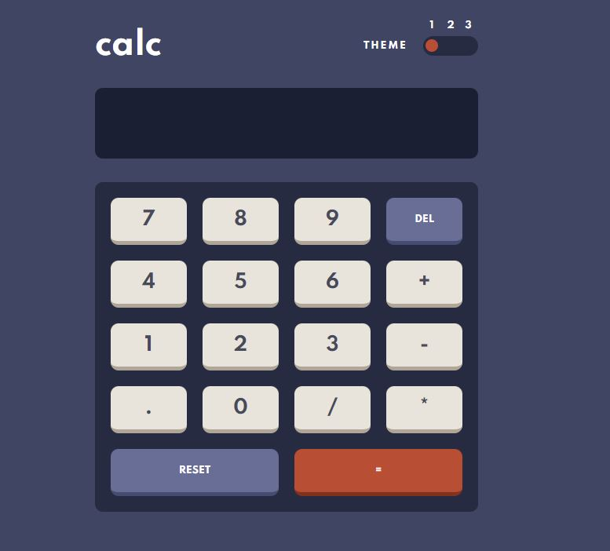

# Frontend Mentor - Calculator app solution

This is a solution to the [Calculator app challenge on Frontend Mentor](https://www.frontendmentor.io/challenges/calculator-app-9lteq5N29).

### Screenshot

### Links

- Solution URL:
- Live Site URL:

### What I learned

I learned a lot from this project.
First of all, I had some issues with the theme switcher. Didn't know what the best approach is so I had to investigate and read a lot of articles but eventually I got there.
Also added 'prefers-color-scheme' which sets theme depending on users operating system setting or user agent setting.

Calculator logic in JS was also a lot of work.
I am proud of successfully adding user input to the calculator.
So u can do all operations with just a keyboard.
Also added 'toLocaleString' which I encountered for the first time. It's a nice hack to separate numbers with commas to make it look like a real calculator.

Overall it was a challenging project and I had a lot of fun working on it! :)
